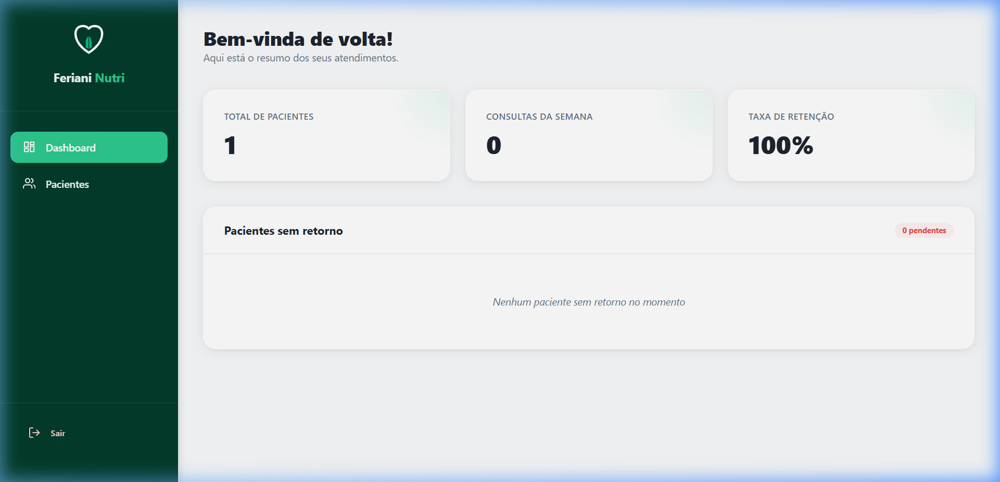

# 🥗 Sistema Nutricionista - Gestão e IA Alimentar

Bem-vindo ao **Sistema Nutricionista**, uma plataforma moderna e intuitiva desenvolvida para otimizar o dia a dia de profissionais da nutrição. Este sistema combina gestão eficiente de pacientes com o poder da Inteligência Artificial para a criação de planos alimentares personalizados.



## 🚀 Tecnologias Utilizadas

Este projeto foi construído com as tecnologias mais modernas do ecossistema web:

- **Frontend**: [React 19](https://react.dev/) com [Vite](https://vitejs.dev/) para um desenvolvimento ultra-rápido.
- **Estilização**: CSS Moderno (Vanilla CSS) com foco em UX/UI premium.
- **Backend & Database**: [Supabase](https://supabase.com/) para autenticação em tempo real e banco de dados PostgreSQL.
- **Inteligência Artificial**: [Google Gemini AI](https://ai.google.dev/) para geração automática de sugestões de planos alimentares.
- **Gráficos**: [Recharts](https://recharts.org/) para visualização da evolução antropométrica dos pacientes.
- **Roteamento**: [React Router](https://reactrouter.com/) para uma navegação fluida.

## ✨ Funcionalidades Principais

- **🔐 Autenticação Segura**: Sistema de login e cadastro integrado ao Supabase Auth.
- **👥 Gestão de Pacientes**: Cadastro detalhado com anamnese, dados de contato e histórico clínico.
- **📊 Evolução em Tempo Real**: Gráficos dinâmicos que mostram a evolução de peso e medidas ao longo das consultas.
- **🤖 Gerador de Planos com IA**: Integração com Gemini AI para gerar rascunhos de planos alimentares baseados nos objetivos e restrições do paciente.
- **📝 Edição Flexível**: O nutricionista tem controle total para editar e personalizar os planos gerados pela IA.
- **📱 Design Responsivo**: Interface otimizada para desktops e dispositivos móveis.

## 🛠️ Como Executar o Projeto

1. **Clonar o Repositório**:
   ```bash
   git clone https://github.com/guuhferiani/sistema-nutricionista.git
   ```

2. **Instalar Dependências**:
   ```bash
   npm install
   ```

3. **Configurar Variáveis de Ambiente**:
   Crie um arquivo `.env.local` na raiz do projeto com as seguintes chaves:
   ```env
   VITE_SUPABASE_URL=seu_url_do_supabase
   VITE_SUPABASE_ANON_KEY=sua_chave_anon_do_supabase
   GOOGLE_API_KEY=sua_chave_da_api_gemini
   ```

4. **Iniciar o Servidor de Desenvolvimento**:
   ```bash
   npm run dev
   ```

## 📄 Licença

Este projeto foi desenvolvido para fins educacionais e de gestão profissional. Sinta-se à vontade para contribuir!

---
Desenvolvido por [Gustavo Feriani](https://github.com/guuhferiani)
